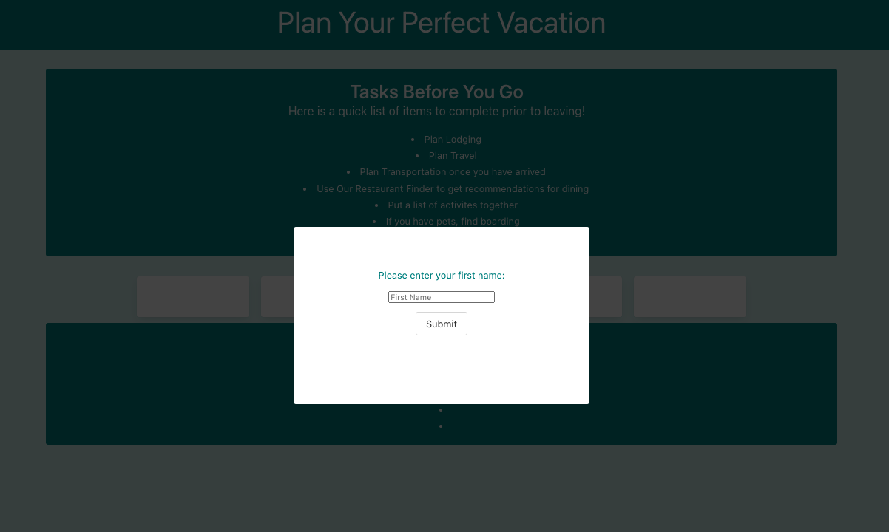
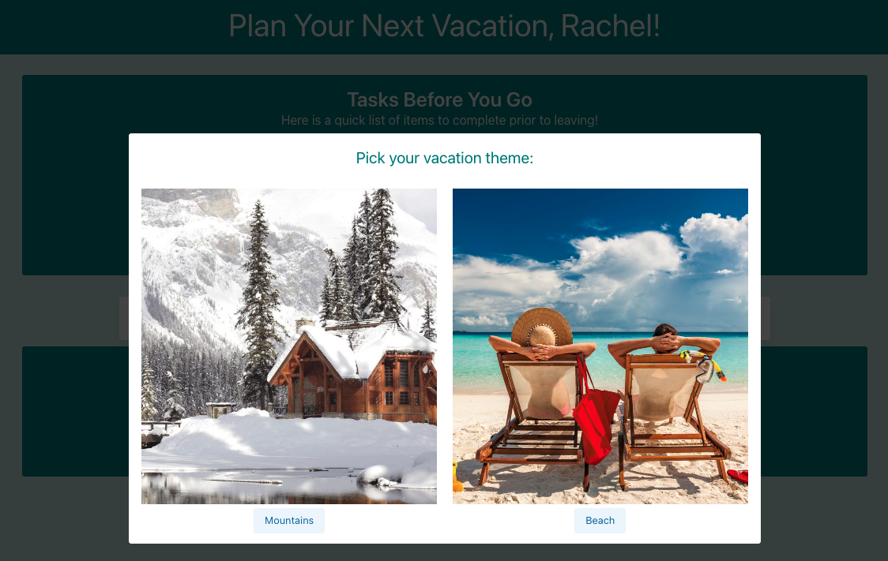
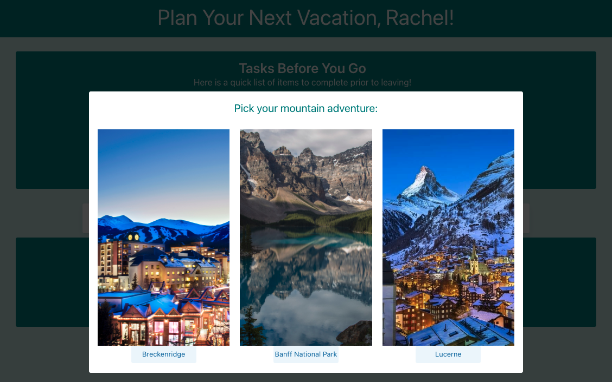
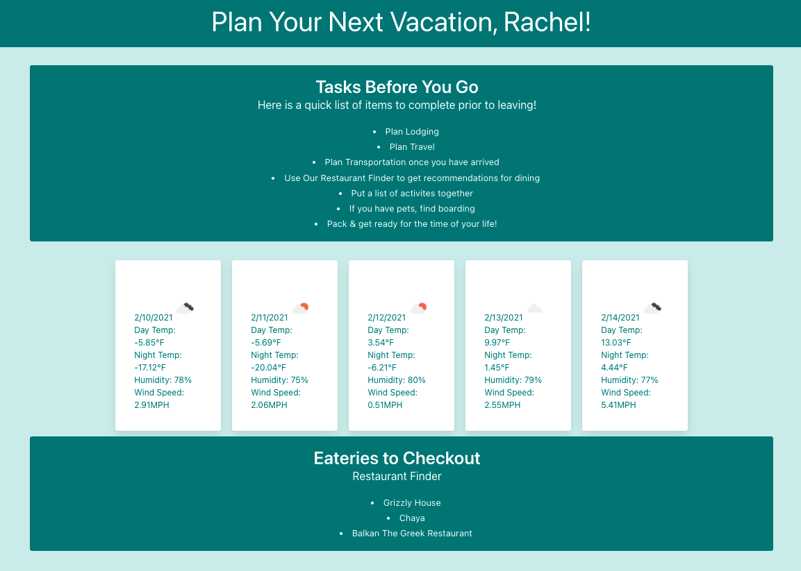
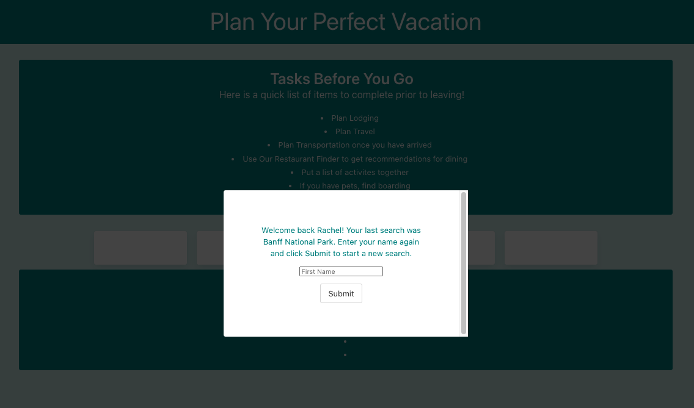

# Vacation Planner - Project One
## This is the readme file for our first project, the vacation planner.

We built this project using HTML, CSS, JS, Bulma, the Open Weather API, and the Zomato API. You'll only need a browser to make this work for you.

## How It Works
1. When the user opens the page, the first modal pops up. The user enters their name into the form and our site will append their name to the header. We'll also set the name entered into local storage.
2. Once the user clicks submit, the second modal appears, and the user decides between a beach and a mountain theme for their vacation.
3. For either theme choice, a third modal appears, and the user is presented with three destination locations.
4. Once the user selects a location, the modals disappear, and the user is presented with the content on the page. At the top of the page, we have a to-do list we prepared for every vacationer, no matter what location they chose. Below the to-do list, we appended the fetched Open Weather content, or five days of weather forecasts, for their chosen location. Below the weather tiles, we appended the fetched Zomato content, or the top three eateries in the chosen location.
5. When the user refreshes the page, the first modal now welcomes them as using their locally stored first name and reminds them of their last selected option. When they go through the modals again, the next refresh will append the most recent location selection.

[Demo of My Page](https://drive.google.com/file/d/1M_CCbE0Xs521InO8FWSQAH44G_JZTp5Z/view)

[Link to Application](https://damiandeleon.github.io/vacation_planner/)

# Contributers:
- Damian De Leon
- Payton Whinnery
- Rachel Amos